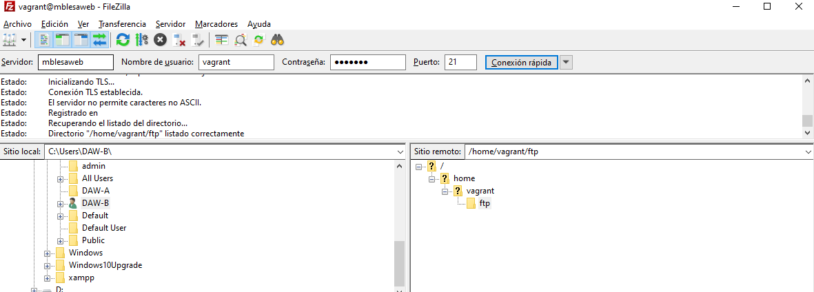
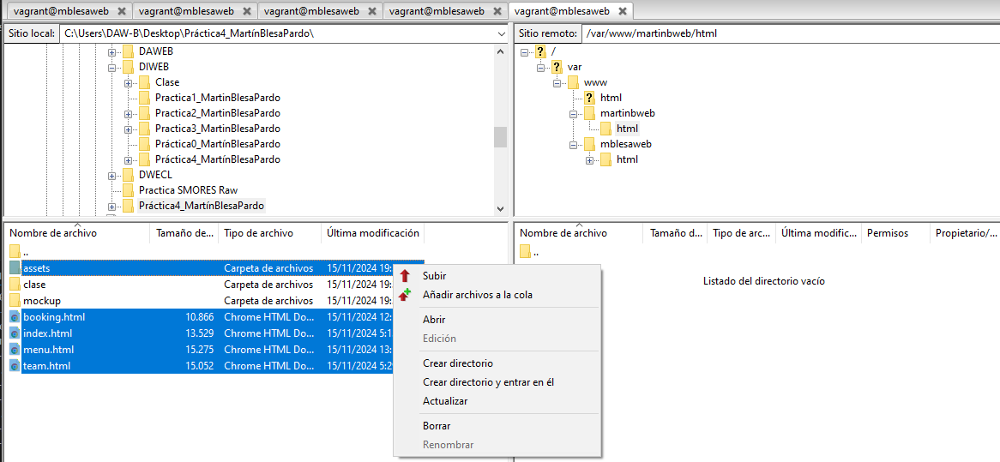
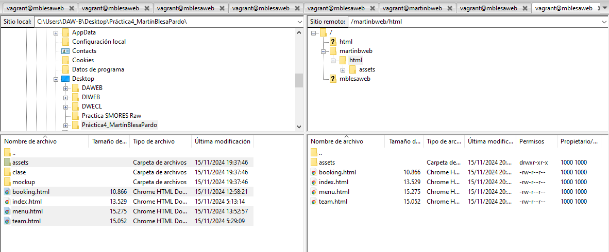

# Instalación y configuración de Nginx
## Configuracion de archivos
En esta sección estará todo lo relacionado a la configuración de archivos.
### Configuración básica de vagrantfile
1. Hemos creado una **configuración básica** del archivo añadiendo el sistema y una provisión que instala el servicio **Nginx**.
La estructura ha quedado tal que así:

```

Vagrant.configure("2") do |config|

  config.vm.define "vm1" do |vm1|

    vm1.vm.box = "debian/bookworm64"

    # Le añadimos una red privada
    vm1.vm.network "private_network", ip: "192.168.57.15"

    # Instalación del servicio Nginx
    vm1.vm.provision "shell", inline: <<-SHELL

      sudo apt-get update
      sudo apt-get install -y nginx

    SHELL

  end
  
end

```

### Configuración inicial de los archivos de Nginx
1. Hemos creado una carpeta llamada **mblesaweb** dentro de _var/www/_ con una carpeta **html** dentro
2. Instalando git previamente, hemos clonado dentro de **html** el repositorio de git: _https://github.com/cloudacademy/static-website-example_
3. Hemos modificado los permisos de las carpetas de tal forma que: 
- El propietario de la carpeta **html** y de todo el contenido de ella sea _www-data_
- Le daremos los permisos adecuados para evitar errores de acceso **no autorizados**

```

# Instalación del servicio Nginx y configuración de este
    vm1.vm.provision "shell", inline: <<-SHELL

      sudo apt-get update
      sudo apt-get install -y nginx
      sudo apt-get install -y git

      # Creación de la carpeta del sitio web
      sudo mkdir -p /var/www/mblesaweb/html

      # Dentro de esa carpeta html, clonamos el siguiente repositorio
      cd /var/www/mblesaweb/html
      git clone https://github.com/cloudacademy/static-website-example

      # Ajustamos los permisos de la carpeta
      sudo chown -R www-data:www-data /var/www/mblesaweb/html
      sudo chmod -R 755 /var/www/mblesaweb

    SHELL

```

### Configuración del archivo default de Nginx
1. Hemos sacado el archivo default de _/etc/nginx/sites-available_ para su configuración
2. Hemos configurado el archivo _default_ en función de las especificaciones requeridas para nuestra web
3. Hemos copiado el archivo _default_ en la máquina virtual tras su configuración
4. Hemos creado un archivo simbólico entre el archivo _default_ y los sitios habilitados
- El archivo default:

```

server {
	listen 80 default_server;
	listen [::]:80 default_server;

	root /var/www/mblesaweb/html;

	# Add index.php to the list if you are using PHP
	index index.html index.htm index.nginx-debian.html;

	server_name mblesaweb;

	location / {
		# First attempt to serve request as file, then
		# as directory, then fall back to displaying a 404.
		try_files $uri $uri/ =404;
	}
}

```

- El archivo vagrantfile:

```

# Instalación del servicio Nginx y configuración de este
    vm1.vm.provision "shell", inline: <<-SHELL

      sudo apt-get update
      sudo apt-get install -y nginx
      sudo apt-get install -y git

      # Creación de la carpeta del sitio web
      sudo mkdir -p /var/www/mblesaweb/html

      # Dentro de esa carpeta html, clonamos el siguiente repositorio
      cd /var/www/mblesaweb/html
      sudo git clone https://github.com/cloudacademy/static-website-example

      # Ajustamos los permisos de la carpeta
      sudo chown -R www-data:www-data /var/www/mblesaweb/html
      sudo chmod -R 755 /var/www/mblesaweb

      # Pegamos el archivo default
      sudo cp /vagrant/default /etc/nginx/sites-available

      # Creamos un archivo simbólico entre el archivo default y los sitios habilitados
      sudo ln -s /etc/nginx/sites-available/ /etc/nginx/sites-enabled/

    SHELL

```

## Comprobaciones de Nginx
### Comprobación del correcto funcionamiento
Como no poseemos **DNS**, lo haremos de forma manual. Vamos a editar el archivo _/etc/hosts_ de nuestra máquina virtual para que asocie la IP de esta a nuestro **server_name**. Para ello:
1. Sacaremos el archivo a nuestro repositorio local mediante: _sudo cp /etc/hosts /vagrant_
2. Le añadiremos la siguiente linea: _192.168.57.15 mblesaweb_
3. Pegamos el archivo hosts de nuevo a la máquina virtual mediante: _sudo cp /vagrant/hosts /etc_
- En el archivo hosts:

```

127.0.0.1	localhost
127.0.0.2	bookworm
::1		localhost ip6-localhost ip6-loopback
ff02::1		ip6-allnodes
ff02::2		ip6-allrouters
192.168.57.15 mblesaweb

```
- En el archivo vagrantfile:

```

# Instalación del servicio Nginx y configuración de este
    vm1.vm.provision "shell", inline: <<-SHELL

      sudo apt-get update
      sudo apt-get install -y nginx
      sudo apt-get install -y git

      # Creación de la carpeta del sitio web
      sudo mkdir -p /var/www/mblesaweb/html

      # Dentro de esa carpeta html, clonamos el siguiente repositorio
      cd /var/www/mblesaweb/html
      sudo git clone https://github.com/cloudacademy/static-website-example

      # Ajustamos los permisos de la carpeta
      sudo chown -R www-data:www-data /var/www/mblesaweb/html
      sudo chmod -R 755 /var/www/mblesaweb

      # Pegamos el archivo default
      sudo cp /vagrant/default /etc/nginx/sites-available

      # Creamos un archivo simbólico entre el archivo default y los sitios habilitados
      sudo ln -s /etc/nginx/sites-available/ /etc/nginx/sites-enabled/

      # Pegamos el archivo hosts
      sudo cp /vagrant/hosts /etc

    SHELL

```
## FTPS
En esta sección veremos toda la configuración relacionada al servidor **FTPS**
### Instalación y preparación inicial del servidor FTPS
1. Instalamos el servicio FTPS: _vsftpd_
2. Creamos los certificados de seguridad necesarios

```

# Instalación del servicio Nginx y configuración de este
    vm1.vm.provision "shell", inline: <<-SHELL

      sudo apt-get update
      sudo apt-get install -y nginx
      sudo apt-get install -y git
      sudo apt-get install -y vsftpd

      # Creación de la carpeta del sitio web
      sudo mkdir -p /var/www/mblesaweb/html

      # Dentro de esa carpeta html, clonamos el siguiente repositorio
      cd /var/www/mblesaweb/html
      sudo git clone https://github.com/cloudacademy/static-website-example

      # Ajustamos los permisos de la carpeta
      sudo chown -R www-data:www-data /var/www/mblesaweb/html
      sudo chmod -R 755 /var/www/mblesaweb

      # Pegamos el archivo default
      sudo mkdir -p /etc/nginx/sites-available/mblesaweb
      sudo cp /vagrant/default /etc/nginx/sites-available/mblesaweb

      # Creamos un archivo simbólico entre el archivo default y los sitios habilitados
      sudo ln -s /etc/nginx/sites-available/ /etc/nginx/sites-enabled/

      # Pegamos el archivo hosts
      sudo cp /vagrant/hosts /etc

      # Creamos una carpeta en nuestro home (ftp)
      sudo mkdir -p /home/vagrant/ftp

      # Creamos los certificados de seguridad
      sudo openssl req -x509 -nodes -days 365 -newkey rsa:2048 \
      -keyout /etc/ssl/private/vsftpd.key -out /etc/ssl/certs/vsftpd.crt \
      -subj "/C=ES/ST=Madrid/L=Madrid/O=mblesaweb/CN=mblesaweb.es"

    SHELL

```
### Configuración del servidor FTPS
1. Sacamos el archivo _/etc/vsftpd.conf_ para su modificación
2. Sustituiremos las siguientes líneas:

```

rsa_cert_file=/etc/ssl/certs/ssl-cert-snakeoil.pem
rsa_private_key_file=/etc/ssl/private/ssl-cert-snakeoil.key
ssl_enable=NO

```

Por las siguientes:

```

rsa_cert_file=/etc/ssl/certs/vsftpd.crt
rsa_private_key_file=/etc/ssl/private/vsftpd.key
ssl_enable=YES
allow_anon_ssl=NO
force_local_data_ssl=YES
force_local_logins_ssl=YES
ssl_tlsv1=YES
ssl_sslv2=NO
ssl_sslv3=NO
require_ssl_reuse=NO
ssl_ciphers=HIGH

local_root=/var/www

write_enable=YES
local_enable=YES
chroot_local_user=YES
allow_writeable_chroot=YES

```
3. Pegamos el archivo ya modificado y **reiniciamos** el servicio

```

# Instalación del servicio Nginx y configuración de este
    vm1.vm.provision "shell", inline: <<-SHELL

      sudo apt-get update
      sudo apt-get install -y nginx
      sudo apt-get install -y git
      sudo apt-get install -y vsftpd

      # Creación de la carpeta del sitio web
      sudo mkdir -p /var/www/mblesaweb/html

      # Dentro de esa carpeta html, clonamos el siguiente repositorio
      cd /var/www/mblesaweb/html
      sudo git clone https://github.com/cloudacademy/static-website-example

      # Ajustamos los permisos de la carpeta
      sudo chown -R www-data:www-data /var/www/mblesaweb/html
      sudo chmod -R 755 /var/www/mblesaweb

      # Pegamos el archivo default
      sudo mkdir -p /etc/nginx/sites-available/mblesaweb
      sudo cp /vagrant/default /etc/nginx/sites-available/mblesaweb

      # Creamos un archivo simbólico entre el archivo default y los sitios habilitados
      sudo ln -s /etc/nginx/sites-available/ /etc/nginx/sites-enabled/

      # Pegamos el archivo hosts
      sudo cp /vagrant/hosts /etc

      # Creamos una carpeta en nuestro home (ftp)
      sudo mkdir -p /home/vagrant/ftp

      # Creamos los certificados de seguridad
      sudo openssl req -x509 -nodes -days 365 -newkey rsa:2048 \
      -keyout /etc/ssl/private/vsftpd.key -out /etc/ssl/certs/vsftpd.crt \
      -subj "/C=ES/ST=Madrid/L=Madrid/O=mblesaweb/CN=mblesaweb.es"

      # Pegamos el archivo vsftpd.conf
      sudo cp /vagrant/vsftpd.conf /etc

      # Reiniciamos el servicio
      sudo systemctl restart vsftpd

    SHELL

```

### Comprobación de conexión al servidor ftp
1. Comprobaremos que podemos acceder al servidor mediante una conexión FTP sin cifrar en el puerto 21



## Tarea

En esta sección configuraremos un nuevo dominio para un sitio web que he desarrollado. Transfiriendo los archivos mediante FTPES a Debian.

Nuestro archivo estará en la carpeta _var/www/_ y le daremos los permisos adecuados, de forma similar a como hemos hecho anteriormente.

Para ello: 
1. **Copiaremos** el archivo **webMartin** y lo pegaremos en la misma carpeta como **webBlesa**. Le daremos la siguiente configuración (además de pegarlo en la máquina virtual):
```

server {
	listen 80;
	listen [::]:80;

	root /var/www/martinbweb/html/static-website-example;

	index index.html index.htm index.nginx-debian.html;

	server_name martinbweb;

	location / {
		try_files $uri $uri/ =404;
	}
}

```

```

# Pegamos el archivo webMartin
sudo cp /vagrant/webMartin /etc/nginx/sites-available/mblesaweb
sudo cp /vagrant/webBlesa /etc/nginx/sites-available/martinbweb

```

2. **Crearemos** la carpeta **martinbweb/html** en _/var/www_ para insertar el archivo **webBlesa** y diferenciarlo del anterior. Además, le daremos los permisos correspondientes a esta.
```

# Creación de la carpeta del sitio web
sudo mkdir -p /var/www/mblesaweb/html
sudo mkdir -p /var/www/martinbweb/html

```

```

# Ajustamos los permisos de la carpeta
sudo chown -R www-data:www-data /var/www/mblesaweb/html/static-website-example
sudo chmod -R 755 /var/www/mblesaweb/html
sudo chown -R vagrant:vagrant /var/www/martinbweb/html/
sudo chmod -R 755 /var/www/martinbweb/html

```

3. **Creamos** el **archivo simbolico** entre el sitio web y los sitios habilitados

```

# Creamos un archivo simbólico entre el archivo los sites y los sitios habilitados
sudo ln -sf /etc/nginx/sites-available/mblesaweb /etc/nginx/sites-enabled/
sudo ln -sf /etc/nginx/sites-available/martinbweb /etc/nginx/sites-enabled/

```

4. **Pegamos** los archivos desde **Filezilla** a la máquina virtual





## Cuestiones finales

### ¿Qué pasa si no hago el link simbólico entre _sites-available_ y _sites-enabled_ de mi sitio web?

- Podrían pasar varias cosas, entre ellas, que el sitio web no esté activo. Debido a esto recibiremos una respuesta genérica por parte del servidor _Nginx_ o bien un error 404.

### ¿Qué pasa si no le doy los permisos adecuados a /var/www/nombre_web?

- El servidor podría no ser capaz de acceder a los archivos, por lo que podría derivar en dos errores, un error 403 o un error 404. También podría conllevar problemas de seguridad así como que el servidor podría no ser capaz de seguir los enlaces simbólicos.